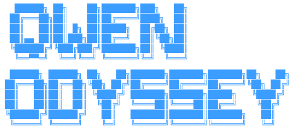

# Qwenodyssey




**An Odyssey-class coding harness for Qwen 3.5 9B and smaller local models.**

Qwenodyssey is a local-first CLI coding agent that wraps a small/medium model
(Qwen 3.5 9B, Qwen2.5-Coder-7B, and anything else you run locally) in the
scaffolding it needs to behave like a much stronger coding agent: explicit
planning, constrained context, patch-based edits, self-review, a test→fix retry
loop, project memory — and per-family decoding that keeps a 9B model from
looping or fumbling its tool calls.

It is a clean-room TypeScript evolution that combines:

- **Odysseus**-style multi-agent orchestration and a step-by-step task pipeline.
- **opencode**-style terminal coding-agent UX (interactive chat, diffs, approvals,
  provider abstraction).

> No source from those projects is copied — only design ideas were adapted.

---

## Why a 7–9B model needs a harness

A 9B model is fast and private, but compared to frontier models it forgets,
hallucinates APIs, and loses the thread on large tasks. Qwenodyssey compensates
*structurally* instead of pretending the model is bigger than it is:

- **Sample it correctly** — each model family gets the decoding its authors
  recommend (Qwen3/3.5 never runs greedy; qwen2.5-coder always does), plus
  per-family thinking control. Automatic; override any knob in config.
- **Give it smaller tasks** — the planner decomposes work into 2–6 steps.
- **Show it only relevant files** — the context engine packs a token budget by priority.
- **Force plans & patches** — structured JSON output, unified diffs, not essays.
- **Run real tests** — feedback comes from the actual test suite, not vibes.
- **Review its own output** — a reviewer agent checks before edits are applied.
- **Retry on real errors** — failures feed an error-fix loop, bounded by config.
- **Remember decisions** — per-project memory survives across sessions.

See [`docs/qwen-optimization.md`](docs/qwen-optimization.md).

---

## Installation

```bash
# from source (current)
git clone https://github.com/Everaldtah/Qwenodyssey
cd Qwenodyssey
npm install
npm run build
npm link        # exposes the `qwenodyssey` command globally
```

Requires **Node.js 18+** and a running model backend (see below).

---

## Quick start

```bash
cd your-project
qwenodyssey init
qwenodyssey config set model.provider ollama
qwenodyssey config set model.model qwen2.5-coder:7b
qwenodyssey code "create a function that validates email addresses and add tests"
```

Qwenodyssey will scan the repo, build a plan, show proposed diffs, ask for
approval, apply the patch, run your tests, and summarize.

---

## Model backends

Qwenodyssey talks to any OpenAI-compatible endpoint.

### Ollama (default)
```bash
ollama pull qwen2.5-coder:7b
qwenodyssey config set model.provider ollama
qwenodyssey config set model.base_url http://localhost:11434
qwenodyssey config set model.model qwen2.5-coder:7b
```

### LM Studio
Start the local server, then:
```bash
qwenodyssey config set model.provider lmstudio
qwenodyssey config set model.base_url http://localhost:1234
```

### OpenAI-compatible / vLLM / llama.cpp
```bash
qwenodyssey config set model.provider openai      # or vllm / llamacpp
qwenodyssey config set model.base_url https://your-endpoint
qwenodyssey config set model.api_key sk-...        # or env QWENODYSSEY_API_KEY
```

### NVIDIA NIM (cloud)
Use a strong hosted model (e.g. `moonshotai/kimi-k2.6`) as the primary brain or a
fallback. Set your key via the `NVIDIA_API_KEY` environment variable — **never commit it**.
```bash
# PowerShell (persisted for your user):
setx NVIDIA_API_KEY "nvapi-..."
# then, in a new shell:
qwenodyssey config set model.provider nvidia
qwenodyssey config set model.model moonshotai/kimi-k2.6
```
`nvidia:<model>` refs also work in `fallback_models`. Endpoint:
`https://integrate.api.nvidia.com/v1`. If the key is missing or a call fails
(auth/quota/network/**timeout**), Qwenodyssey transparently falls back to the next
model in the chain.

Notes on NIM models: NIM's catalog churns (models reach end-of-life and start
returning HTTP 410), so verify before relying on one. **Reliable** picks as of
2026-06: `moonshotai/kimi-k2.6`, `nvidia/nemotron-3-ultra-550b-a55b` (reasoning,
tool-capable), and `meta/llama-3.3-70b-instruct`. Reasoning is handled per family:
- **Nemotron** uses `chat_template_kwargs.enable_thinking` + `reasoning_budget`
  (`[nvidia].nemotron_thinking` / `reasoning_budget`) and returns its chain-of-thought
  in a separate `reasoning_content` field, which Qwenodyssey drops — answers stay clean.
- **kimi-k2.6 / deepseek-v4 / *-r1** degenerate or leak raw CoT on NIM, so
  `[nvidia].disable_thinking` (default on) sends `chat_template_kwargs.thinking=false`.

`[nvidia].request_timeout_ms` (default 90s) makes a stalled hosted model fail over
instead of hanging.

See [`docs/providers.md`](docs/providers.md).

## Live voice + vision (`qwenodyssey live`)

Talk to the model out loud and let it see your webcam — senses run locally, the
frontier model is the brain, the reply is spoken:

```
🎤 mic ─▶ whisper.cpp (local STT) ─────────┐
                                            ├─▶ frontier model ─▶ reply ─▶ Piper TTS ─▶ 🔊
📷 camera ▶ local vision model (Ollama) ────┘
```

- **Continuous & hands-free:** `whisper-stream` listens with voice-activity
  detection — just talk, no push-to-talk. Listening mutes itself while the model
  speaks so it doesn't hear its own voice.
- **Local vision:** a fresh frame is captured per turn and described by a local
  Ollama model (e.g. `moondream`); the description (not the image) is sent to the
  brain. Toggle the camera with `c`, mute with `m`, quit with `q`.
- **Spoken replies:** local Piper neural TTS (or `tts.engine = "sapi"` for the
  built-in Windows voice).

**Setup (Windows):**
```powershell
scoop install ffmpeg whisper-cpp          # capture + speech-to-text
ollama pull moondream                      # local vision
# whisper model + Piper live under ~/.qwenodyssey/ (models/, piper/)
qwenodyssey live
```
Configure under `[vision]`, `[audio]`, `[tts]` (see the sample config). Frames and
audio stay on your machine; only extracted text reaches the cloud brain.

### Omni mode (one model does everything)

Set `[omni].enabled = true` and `live` instead sends your **mic audio + a camera
frame straight to a single multimodal model** that hears, sees, and reasons in one
call (Node-side voice-activity detection segments your speech — still hands-free).
`nvidia/nemotron-3-nano-omni-30b-a3b-reasoning` is verified for audio+vision+reasoning
on NIM. In this mode audio and frames go to the cloud. Test pieces independently:
`qwenodyssey miclevel` (mic meter), `qwenodyssey mictest` (transcription + omni audio).

---

## Commands

| Command | Description |
|---------|-------------|
| `qwenodyssey init` | Create the `.qwenodyssey` workspace |
| `qwenodyssey chat` | Interactive pair-coding chat (streaming); `-c/--continue` resumes the last session, `--resume [id]` picks one |
| `qwenodyssey code "task"` | Full pipeline: plan → edit → review → test |
| `qwenodyssey swarm "task"` | Coordinated multi-model team with a live split-pane TUI (see [Agent swarm](#agent-swarm-coordinated-multi-model)) |
| `qwenodyssey edit <file> "instruction"` | Edit a single file |
| `qwenodyssey plan "goal"` | Produce a plan without editing |
| `qwenodyssey review` | Review the current git diff |
| `qwenodyssey test` | Detect & run the project's tests |
| `qwenodyssey apply [--rollback]` | Apply pending edits / roll back last patch |
| `qwenodyssey memory add/search/list/clear` | Project memory |
| `qwenodyssey config get/set/list` | Configuration |

### Modes (on `code`)
- `--fast` — minimal planning, direct edit
- `--safe` — plan + review + confirm (**default** in `small_model_mode`)
- `--deep` — plan + code + review + test + retry loop
- `--autofix` — run tests, diagnose, patch, repeat

See [`docs/cli-usage.md`](docs/cli-usage.md).

### In chat (v0.2)

Long sessions now stay coherent on small-context local models, and you can pick a
conversation back up later:

- **Resumable sessions** — every turn is checkpointed to `~/.qwenodyssey/sessions/`.
  `qwenodyssey chat -c` continues the last conversation in this directory;
  `qwenodyssey chat --resume` opens a picker; `/sessions` and `/resume <id>` work in-chat.
- **Context auto-compaction** — as the history approaches the model's context budget,
  the oldest turns are automatically summarized into a memo so you never overflow (or
  silently lose the system prompt). `/context` shows a live usage bar; `/compact` forces it now.
- **Plan tracking** — the model can call the `update_plan` tool to lay out and tick off
  the steps of a multi-step task, which keeps small models on track over long tool chains.
  `/plan` shows the current checklist.

---

## Example session

```
$ qwenodyssey code "add an isPrime helper and a test"

→ Scanning repo…
→ Planning…

Proposed plan: Add an isPrime utility with tests
Files likely needed:
  - src/math.ts
Steps:
  1. Add isPrime(n) to src/math.ts
  2. Add tests in tests/math.test.ts
Proceed with this plan? (Y/n)

CREATE src/math.ts
+ export function isPrime(n: number): boolean { ... }

Reviewing… approved
Apply these edits? (Y/n) y
✓ create src/math.ts
✓ create tests/math.test.ts
→ Running tests… ✓ Tests passed.

── Summary ──
Added isPrime() and a passing test. No other files touched.
```

More in [`docs/examples.md`](docs/examples.md).

---

## MCP servers (Model Context Protocol)

Qwenodyssey can connect to external [MCP](https://modelcontextprotocol.io) servers
and surface their tools to the agent — filesystem, git, Postgres, Puppeteer, Slack,
or any of the growing ecosystem — with no bespoke integration. Each server's tools
appear to the model namespaced as `mcp__<server>__<tool>`.

It's opt-in. Add an `[mcp]` block to your config (`~/.qwenodyssey/config.toml` for
machine-wide, or a project's `.qwenodyssey/config.toml`):

```toml
[mcp]
enabled = true

[mcp.servers.filesystem]
command = "npx"
args = ["-y", "@modelcontextprotocol/server-filesystem", "C:\\Users\\evera"]

[mcp.servers.git]
command = "uvx"
args = ["mcp-server-git"]
# env = { SOME_TOKEN = "..." }   # extra env the server needs
```

On launch Qwenodyssey spawns each enabled server over stdio, completes the MCP
handshake, discovers its tools, and prints e.g. `✦ MCP filesystem: 11 tools`. A
server that fails to start is skipped with a one-line reason — it never blocks the
others or chat startup. Servers are shut down cleanly when you exit. Transport is
stdio (the common case); HTTP/SSE servers aren't supported yet.

## Agent swarm (coordinated multi-model)

`qwenodyssey swarm "<task>"` runs a **team of frontier models in parallel** that
actually coordinate — instead of one model doing everything, a lead model splits
the task, the agents share results, and you watch them all work live.

```bash
cd ~                       # run from home so it uses your configured cloud roster
qwenodyssey swarm "Design a production rate-limiter: algorithm, storage, and API, then integrate."
qwenodyssey swarm --demo   # rehearse the live TUI with fake agents — no models called, no cost
```

**How it works**

1. **Plan** — a lead model decomposes the task into dependency-aware subtasks
   (`{id, title, detail, dependsOn[]}`) and judges the project `simple` or `complex`.
   A *planner ladder* tries each roster model in turn, so one slow/timed-out lead
   never collapses the whole run.
2. **Waves** — independent subtasks run **in parallel**; dependent ones wait for the
   results they need (topological scheduling).
3. **Shared blackboard** — every agent's prompt is injected with its dependencies'
   actual outputs plus a roster of what teammates are doing, so later agents *build
   on* earlier ones instead of working blind.
4. **Integrate** — a lead model merges the whole board into one coherent deliverable.

**Live TUI** — one pane per agent, each a mini Qwenodyssey dashboard streaming its
work in real time:

```
┌ ⠴ kimi-k2.6 · subtask 1                    8s ┐ ┌ ✓ nemotron-3-ultra · subtask 2        12s ┐
│ ▟█▜▛█▙   Qwenodyssey v0.3.0                   │ │ ▟█▜▛█▙   Qwenodyssey v0.3.0                │
│ ▜█▟▙█▛   moonshotai/kimi-k2.6 · nvidia        │ │ ▜█▟▙█▛   nvidia/nemotron-3-ultra · nvidia  │
│  ▀▘▝▀    C:\Users\evera                       │ │  ▀▘▝▀    C:\Users\evera                    │
│───────────────────────────────────────────────│ │────────────────────────────────────────────│
│ choosing a sliding-window-log algorithm with…  │ │ # Storage schema  CREATE TABLE url_maps…   │
└                                                ┘ └                                            ┘
2/4 done · exec: daytona sandbox   Ctrl-C aborts
```

The TUI needs a **real terminal** (run it in Windows Terminal / a normal shell, not
inside `qwenodyssey chat`). It falls back to a plain line log over a pipe or with
`--no-live`.

**Execution backends** — by default swarm agents are text-only. Let them *run
commands* to build and verify real projects with `[swarm] exec`:

| `exec` | Behavior |
|--------|----------|
| `off` (default) | Agents produce text only. |
| `bare` | Commands run on **your machine** through the same hard-block/destructive guardrails as `run_shell` (destructive commands are refused — a swarm has no interactive confirm). |
| `daytona` | Commands run in an **isolated [Daytona](https://daytona.io) sandbox** — one per run, shared by all agents so their files compose, deleted afterwards. |
| `auto` | **Bare metal for `simple` plans, a Daytona sandbox for `complex` ones** (falls back to bare metal, with a note, when no `DAYTONA_API_KEY` is set). |

```toml
[swarm]
exec = "auto"            # or off / bare / daytona ; CLI: --exec <mode>

[daytona]
enabled = true           # key comes from the DAYTONA_API_KEY env var
```
```powershell
setx DAYTONA_API_KEY "dtn_..."   # get one at app.daytona.io → API keys
```

The **roster is frontier-first**: it uses the cloud models in `model.fallback_models`
that have keys, falling back to local models only when none are available. Useful
flags: `--list` (show the roster, no calls), `--divide "a" "b" …` (supply subtasks
yourself), `--plain` (classic uncoordinated ensemble), `--no-synth`.

The same capability is available to the chat agent as the `agent_swarm` tool.

---

## Safety

- Dangerous shell commands (`rm -rf /`, `mkfs`, `dd`, fork bombs, `shutdown`…) are
  **hard-blocked**; other destructive commands require confirmation.
- Every tool call is logged to `.qwenodyssey/logs/session-*.jsonl`.
- Edits are journaled to `.qwenodyssey/patches/` and can be rolled back.
- Qwenodyssey warns when the working tree is dirty before applying changes.

---

## Roadmap

- [ ] VS Code & Cursor integration
- [ ] Claude Code compatibility mode
- [ ] OpenClaw plugin
- [x] MCP (Model Context Protocol) support — stdio servers (see [MCP servers](#mcp-servers-model-context-protocol))
- [ ] Browser/research tool
- [ ] Vector-database memory (semantic recall)
- [x] Multi-model debate mode — coordinated [agent swarm](#agent-swarm-coordinated-multi-model)
- [ ] Qwen 14B/32B profiles
- [x] Remote sandbox workers — [Daytona](https://daytona.io) execution backend for the swarm
- [ ] Tree-sitter symbol extraction for sharper context

See [`docs/architecture.md`](docs/architecture.md) for the design and current
status of each subsystem.

## License

MIT — see [LICENSE](LICENSE).
